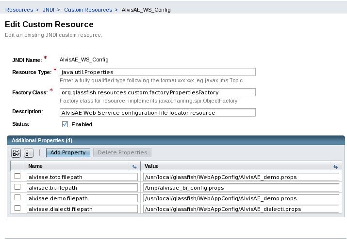

# Configuration of the WebService via external parameters

## Context

In its original implementation, the WebService Datasource was configured via a property file which must be embedded within the war file.
this solution is not very flexible, and force to repackage the war file for each new instance of the WS;

A better solution would be to enable the WS to use a property file which is not included in the war file. 
It should be possible to deploy the same war file for several distinct instances of the WS connected to distinct datasources.

Several mechanisms can be used to associate the correct property file to each instance.

Currently, during thier initialization, the Web services will check in sequence :
1. web param based configuration,
2. JNDI custom resource based configuration,
3. embedded property file based configuration

<pre></pre>
>>>*Important Notice: the following configuration methods only work with GlassFish v3.0 and above*
<pre></pre>

## Configuration of the WebService via servlet web param

Note: This is the preferred solution, since it is easier to set up than the mechanism based on JNDI Custom resource described in the following section.

A web parameter can be associated to any already deployed servlet, hence overriding the original web.xml contained in the war package.
So to configure itself, the latest version of the servlet will search for a web param named @configFilePath@.

The following GlassFish console command associates to the servlet named @AlvisAE-ws-demo@ the web parameter @configFilePath@ , whose value is the property file path @/usr/local/glassfish/WebAppConfig/AlvisAE-demo.props@ 
<pre>
/usr/local/glassfish/current/bin/asadmin set-web-context-param --name configFilePath --value '/usr/local/glassfish/WebAppConfig/AlvisAE-demo.props' 'AlvisAE-ws-demo'
</pre> 

the new parameter value will be taken into account after that the server has been restarted
<pre> 
/usr/local/glassfish/current/bin/asadmin restart-domain 
</pre> 

## Configuration of the WebService via JNDI Custom Resource

This was the first proposed solution, making use of JNDI Custom resource (might be still used in non-serlet web container).

Knowing its own context root, the WS instance can easily retrieve the path of the property file to use from a common JNDI resource stored within the Application Server.

### Set-up of the resource in GlassFish

in this exemple :
the WS deployed on @/alvisae/demo/@ will search in the JNDI resource named @AlvisAE_WS_Config@ the value associated to the key @alvisae.demo.filepath@ 
(the custom resource being an instance of @java.util.Properties@).

